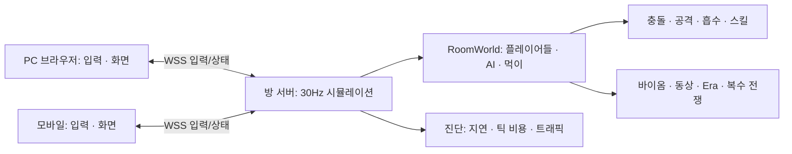

# 멀티플레이 구상·기획 — M60 초안

## 목표와 범위

현재 정적 웹 싱글플레이를 유지하면서 **초대 링크로 두 사람이 같은 월드에 들어가 AI와 성장·흡수·전쟁을 함께 경험하는 것**을 첫 목표로 한다. 이후 한 방 최대8명으로 확장한다. 종족·이름 선택, 모바일/PC 조작과 기존 생태 규칙을 공유한다. 이번 단계는 기획이며 접속 서버나 실시간 동기화를 구현/배포한 상태가 아니다.

첫 버전: 비공개 초대 방 생성/입장, 최대2명, 기존 AI/먹이와 공유 월드, 각자 Life·점수·성장, 방 내 순위, 재접속, 실제 두 브라우저 검증. 계정·장기 저장·공개 매칭·랭크·음성채팅·관전은 후속으로 둔다. 방의 Era/눈보라/전쟁 시계는 하나이며 새 참가자는 현재 방 시간에 입장한다. 늦은 입장의 성장 열세는 별도 밸런스 문제로 측정한다.

## 권장 구조: 서버가 판정하고 브라우저가 그린다

클라이언트가 위치/HP/성장/공격 피해를 결정해 보내는 구조는 피한다. 서버가 이동·차징·회피·흡수·E/R·버프·전쟁 피해 누적을 계산하고, 클라이언트는 입력과 조준 방향만 보낸다. 서버는 이름/종족/버튼/방향/입력 빈도와 상태를 검증한다. 공격 최대 피해·성장·소환 개체수는 기존 규칙을 그대로 서버가 적용한다.

런타임은Node.js+WebSocket을 초기 후보로 한다. 접속/상태 전송이 단순하고 현재ES모듈의 판정 로직을 공유하기 쉽다. 초기 방 서버는 메모리 월드로 운영하고 DB는 첫 접속 목표에 필수로 넣지 않는다. 정적 클라이언트는 현재처럼 제공할 수 있지만 실제 플레이에는 별도 HTTPS/WSS 서버 주소가 필요하다. raw.githack 링크만으로 공유 월드를 호스팅할 수는 없다.

## 기존 코드에서 먼저 분리할 부분

| 현재 구조 | 분리 방향 |
| --- | --- |
| Game에하나의`player`/`input`/Life | RoomWorld의players Map + 참가자별input/Life, 클라이언트LocalPlayer ID |
| 판정과Canvas/UI/audio가한클래스에존재 | SimulationCore가이벤트를생성, ClientView가렌더링·소리를소비 |
| 전역random상태와entity ID 카운터 | 방별RNG와ID할당기. 한방리셋이다른방난수/개체에영향을주지않음 |
| Game.handlePlayerDefeat와전역gameOver | 개별참가자패배/리스폰, 한명패배로다른사람월드가멈추지않음 |
| 플레이어중심시야/자동플레이/기회평가 | 각관찰자별시야와통계, 서버AI와클라이언트입력구분 |
| 직접UI/audio호출 | 피해/성장/흡수완료/스킬/전쟁/환경 이벤트 큐 |

기존 싱글플레이는 같은 SimulationCore를 로컬 어댑터로 실행한다. 분리 전후 같은 시드/입력으로 성장·충돌·Life·전쟁 결과가 일치하는지 확인한다. 전역 상태를 그대로 둔 채 여러 방을 동시에 돌리지 않는다.

## 입력·상태 계약 초안

| 메시지 | 핵심 필드 | 처리 |
| --- | --- | --- |
| join | 방코드,버전,이름,종족 | 서버가playerId/재접속토큰/월드seed/현재tick/규칙버전을지급 |
| input | seq,이동벡터,조준각,흡수On,버튼press/release | seq순서로서버틱에적용.각행동번호는한번만소비 |
| snapshot | serverTick,ackInputSeq,관찰영역의개체/효과/자원 | ID기준생성·수정·제거.최초접속/누락복구는전체동기화 |
| event | eventId,tick,피해/성장/사망/흡수/스킬/전쟁 | 중복제거후화면·소리·로그반영 |
| ping/resume | 연결지연/재접속토큰/마지막확인번호 | 슬롯확인및현재전체상태복구 |

차징은서버가받은press시점부터release시점까지계산하고0.9초상한을적용한다. 클라이언트가"2배피해"를보내지않는다. 끊긴연결/포커스전환시held입력을해제하고유령발사를막는다. 이동입력은정규화한다. 흡수는명시적On/Off이며재접속후OFF로시작한다. E/R조준점은월드랩규칙에맞춰검증한다. 참가자에게모든개체의개인입력상태를전송하지않는다.

초기수치후보: 서버30Hz, 상태전송15Hz, 입력변화즉시전송+100ms heartbeat. 먼저정확성/두클라이언트일치를검증하고주파수/압축을측정후조정한다. 실제성능을측정하기전확정값으로간주하지않는다.

## 지연을 감추는 방식

내이동은즉시예측해반응시키고서버ack이오면확인되지않은입력을다시적용한다. 다른개체는약100ms버퍼로보간한다. 공격예고/돌진의서버시작틱과소요시간을보내클라이언트가애니메이션을재현한다. HP·피해·먹이획득·흡수완료·최상위직위는서버결과만확정한다.

랩맵의보간은항상가장가까운월드이미지차이를사용해반대끝이동을맵중앙을가로지르는움직임으로그리지않는다. 긴순간이동/리스폰은보간하지않는다. 첫버전은서버현재틱충돌판정을사용하고, 지연보상은실제공격체감측정후후보로남긴다.

## 관심 영역과 환경/생태 동기화

서버는전체월드를계산하지만각클라이언트에는시야·몸반경·최대공격이동/스킬범위를고려한주변상태를전송한다. 큰몸/긴스킬/랩경계의상대가중심좌표기준으로누락되지않도록검증한다. 월드타일은seed와버전으로공유하고먹이는청크별초기목록/생성/수집변경을전송한다. 통신청크와배경렌더패스는독립시켜지형이개체를덮는오류를재발시키지않는다.

눈보라활성/동상노출·잔여시간/물속이동보정은서버계산, 설원밖눈발·시야그라데이션은로컬표현이다. 소환체와집결명령도서버개체이며모든참가자가같은결과를본다. 최상위목록·전쟁상대ID집합·20%누적피해·전쟁기종료는서버가관리한다. 클라이언트가Era시계를따로진행시키지않는다.

## 일시정지·이탈·재접속

멀티플레이의ESC는메뉴/입력정지이며방전체일시정지가아니다. 다른참가자는계속플레이한다. 메뉴중내캐릭터는월드에남아피해를받을수있음을표시한다. 브라우저백그라운드나heartbeat중단500ms이상은이동/차징/흡수를중립화한다.

초기재접속유예후보는10초. 유예중캐릭터는제자리에남고공격에취약하다. 토큰으로재접속하면현재상태를복구한다. 유예만료시월드에서제거하고재입장은새참가로취급한다. 무적보호/진행영구저장등의추가정책은후속기획으로둔다. 연결복구로피해/보상/스킬이중적용이발생하지않도록eventId와행동번호를검증한다.

## 구현 순서와 통과 기준

1. **시뮬레이션 분리:** 기존싱글플레이회귀통과, 두독립월드동시진행/리셋상호영향0. 서버에DOM/Canvas/audio의존없음.
2. **두 사람 방:** 로컬WSS대체가능전송어댑터+방생성/초대/입장, 서로이동·공격·회피·흡수/성장/Life결과일치. 두브라우저영상/상태로그로검증.
3. **전체 규칙 동기화:** E/R·아군집결·소환·동상·물·최상위/전쟁·랩경계·재접속. 복수공격자의전쟁상대누적과한먹이중복성장0을검증.
4. **외부 테스트 서버:** HTTPS/WSS주소설정, PC+모바일실제다른네트워크접속. 실제배포대상/운영정보는구체구현후정한다.
5. **8명 확대:** 실제8연결+현재AI/먹이,지연100/200ms·순간단절·대형개체/스킬폭주·오래된클라이언트버전검증. 서버틱p95가33ms미만인지우선측정하고스냅샷크기/인당트래픽/메모리도기록한다.

첫인수기준은"서로다른두브라우저에서같은상대에게같은피해·성장을확인"이다. 스크린샷만으로동기화완료를선언하지않는다. 실측전에는동시접속8명이나특정회선에서의플레이품질을보장하지않는다.

## 백로그로 남길 주제

공개매칭/관전/지속저장, 사람이합류했을때의AI수감소,늦은입장성장보정,핑별공격적중체감과지연보상,룸단위부하분산,소환/흡수/동색전쟁의사람간밸런스. 초기두사람동기화가성립한뒤순서대로결정한다. 실제구현태스크는 [개발백로그](DEVELOPMENT_BACKLOG.md)에연결한다.
