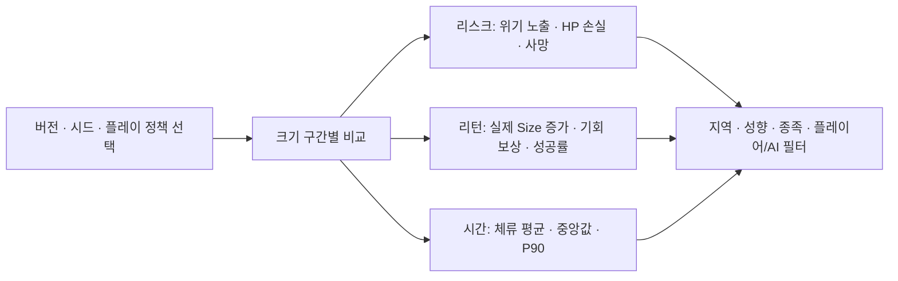
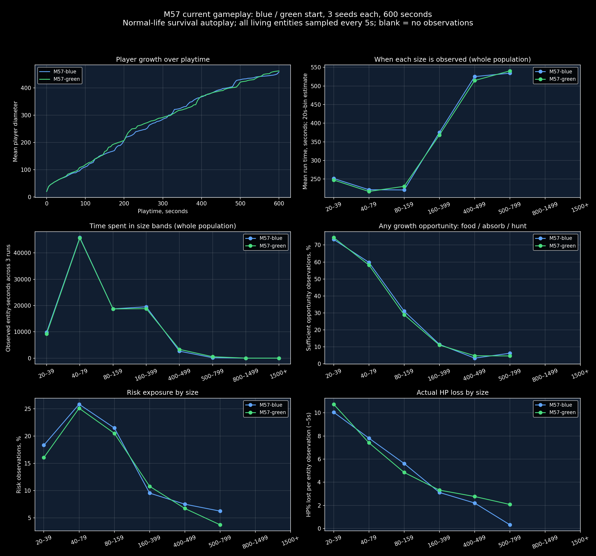

# 크기별 리스크·리턴·평균 체류 시간 시각화 기획 — M58

목표: Size350~400의 경계/반격과 Size600 전투 템포를 성장 보상 및 체류 시간과 함께 평가한다. **진행시간 평균, 전체 개체 관찰 시간, 한 생애의 구간 체류 시간은 서로 다른 값**이다.

## 대시보드 구성

한 화면에 같은 가로축을 가진 세 그래프를 세로로 배치한다. 구간은20–39,40–79,80–159,160–299,300–349,350–399,400–499,500–599,600–799,800–1499,1500+. 선택한 막대를 누르면 상세 패널에 표본 수·시드 수·지역/성향·원인별 피해와 성장 출처를 보여준다. 부족한 표본은 빈칸 또는 경고로 표시한다.

| 그래프 | 기본 값 | 보조 값 / 해석 |
| --- | --- | --- |
| 리스크 | 관찰초당 실제 HP 손실 / 그 시점 최대HP (%) | 위기 조우 간격·사망률, 적 공격/지형/흡수 비용 분리. 회복 전 피해량을 기록해 회복으로 가려지는 손실 방지 |
| 리턴 | 구간 체류초당 실제 Size 증가 | 먹이/사냥/흡수 별 Growth와 Size 증가, 기회당 잠재 보상과 실제 획득 성공률 분리 |
| 평균 체류 시간 | 완료된 한 생애의 연속 구간 체류초 평균 | 중앙값/P90, 진입 수/완료 수/사망 수/관찰 종료 수를 함께 표기 |

리스크/리턴 산점도도 제공한다. X는실제HP손실%/초,Y는실제Size증가/초,점크기는체류시간,색은크기구간이다. 잠재 보상과 실제 보상을 한 숫자로 섞지 않는다. 흡수 비용은 `0.12 × 흡수자 최대HP × min(1,상대Size/내Size) × 상대 남은HP비율`이며 진행량 비례로 차감한 실제 비용을 표시한다.

## 체류 시간 수집 규칙

개체ID+생애ID마다 구간 진입 시각을 저장한다. 다음 구간으로 이동하면 종료 시각과 차이를 기록한다. 다시 진입하면 새 에피소드다. 사망/흡수로 종료되면 실패 체류로 별도 집계한다. 관찰 종료 시 아직 머무르는 개체는 우측 절단 표본이며 완료 체류 평균에 섞지 않는다. 완료 표본만의 평균에는 생존 편향이 있으므로 절단 비율과 구간 탈출/사망 곡선도 함께 제공한다. 한 번에 여러 구간을 건너뛰면 관측되지 않은 구간을0초 체류처럼 만들지 않는다. 일시정지 시간은 제외한다.

정밀 수집은 매 업데이트의 게임 시간을 사용한다.5초 샘플로 경계를 추정한 값에는±5초 오차를 표시한다. 성장할 때 최대HP가 증가하므로 실제 피해 이벤트의 당시 최대HP를 분모로 사용한다. 개체별/시드별 집계를 먼저 만들고 시드 평균과 범위를 보여준다. 표본 수가 많은 한 시드가 전체 결론을 독점하지 않게 한다.

## 현재 볼 수 있는 자료와 구현 대기

위 그림은 **M57 규칙,6회×600초 기준선**이다. 평균 진행시간은 그 크기가 관측된 시간이며 평균 체류 시간이 아니다.350~399와600~799를 따로 분리하지 않으므로 해당 구간의 상세 평가를 대신하지 않는다. M58의 공격 시간/흡수 비용/영구 소환 효과가 반영된 재측정 자료가 아니다. Size800 이상은 표본이 없다.

기존 balance.html의 크기별 기회/위기·진행시간·개체초 그래프는 사용 가능하다. 위의 새 세부 구간, 생애별 체류 에피소드, 피해 원인 분리, 산점도와 절단 곡선은 [개발 백로그](DEVELOPMENT_BACKLOG.md)에서 후속 구현한다. 먼저 전투/렌더링 버그 수정의 실제 플레이 피드백을 받는다. 기획 예시를 실측 그래프로 표시하지 않는다.

## 다음 비교 실험

같은 시드와 같은 정책으로 M57/M58 비교. 자동 충전 없는 정책과 충전/반격 정책을 분리한다. 크기350,400,600 고정 초기 전투 시나리오는 자연 성장 시뮬레이션과 별도 표시한다. 실험 변수는 공격 시간,경계 반격,흡수 비용 계수,소환 흡수 대기시간을 한 번에 하나씩 변경한다. 경계 거리 유지 중 접촉초/적 공격 횟수/반격 횟수와 성장체류를 함께 확인한다. 목표 수치는 실제 사용자 체감과 연결해서 정하고 현재 임의 기준을 이상적 값이라고 확정하지 않는다.
